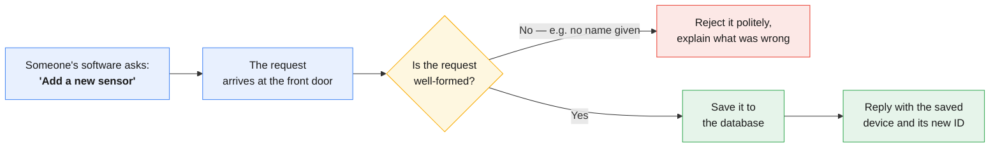
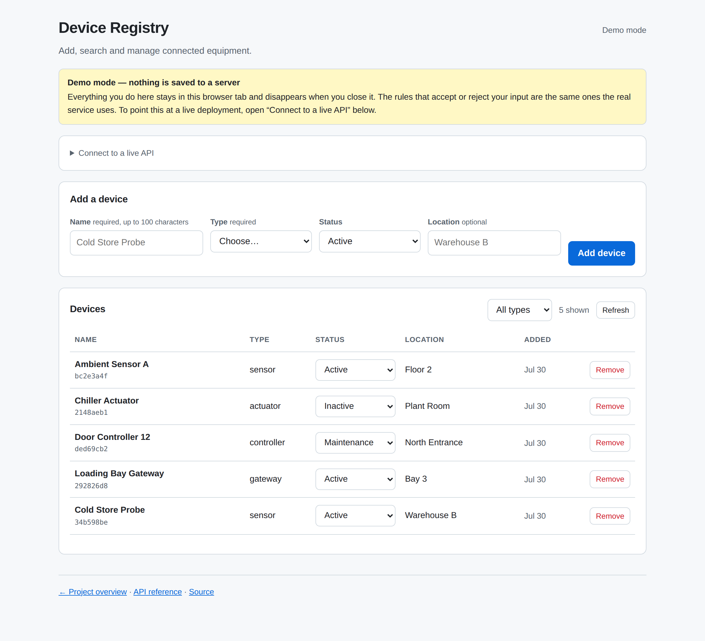
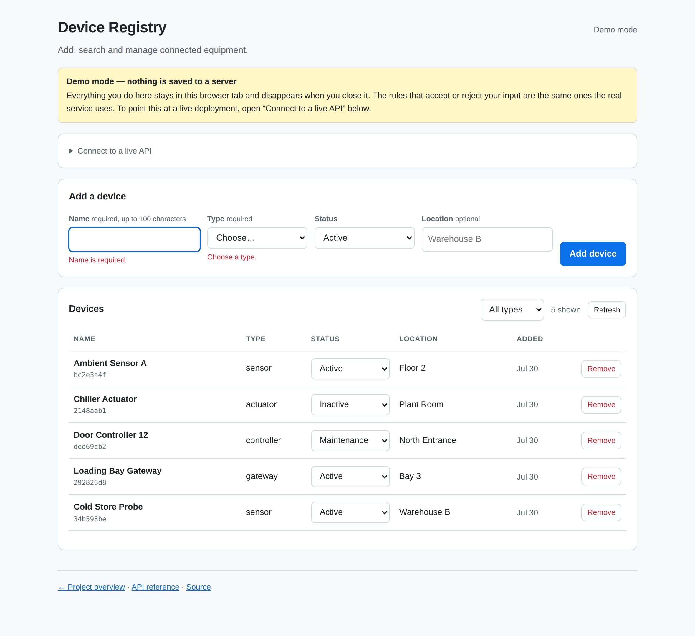
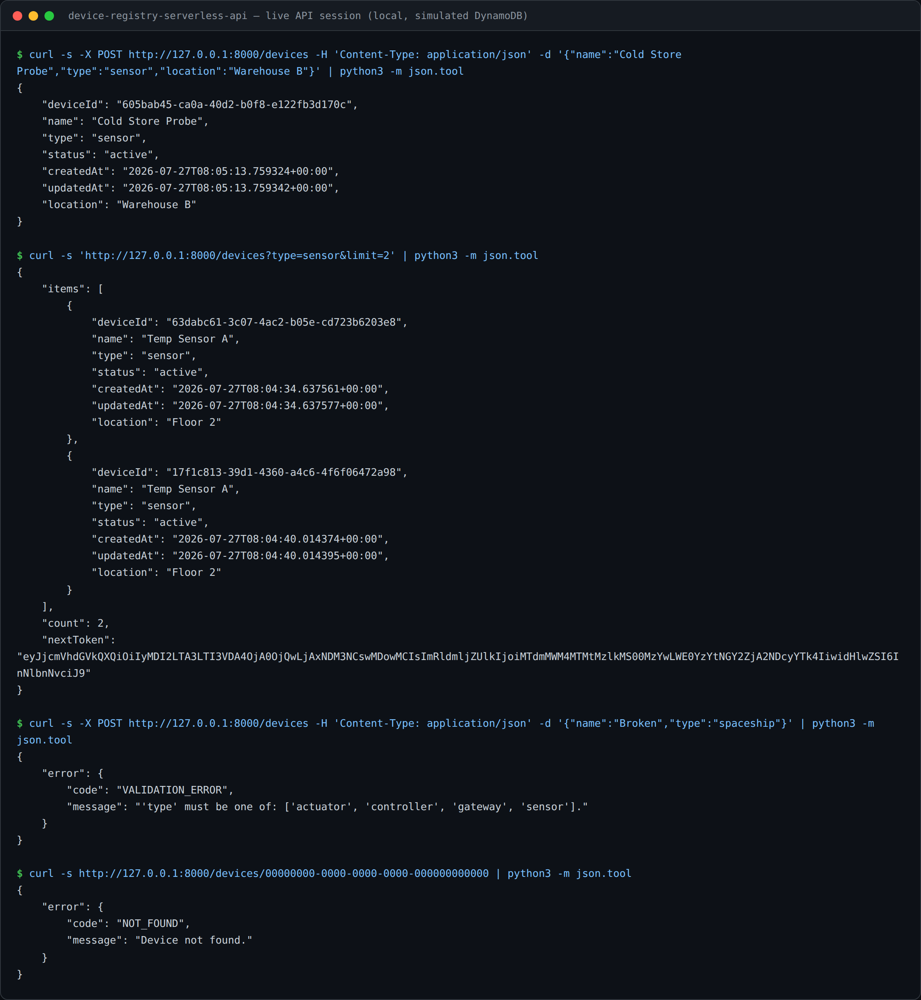
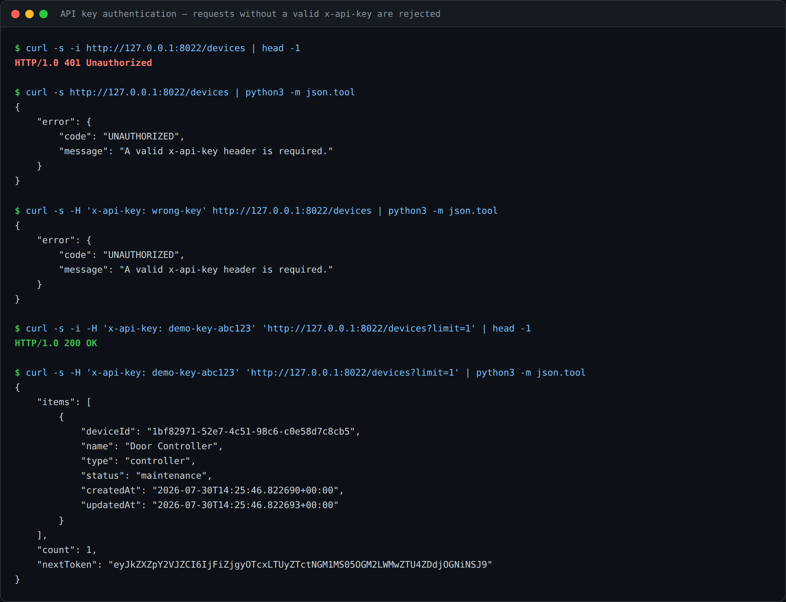
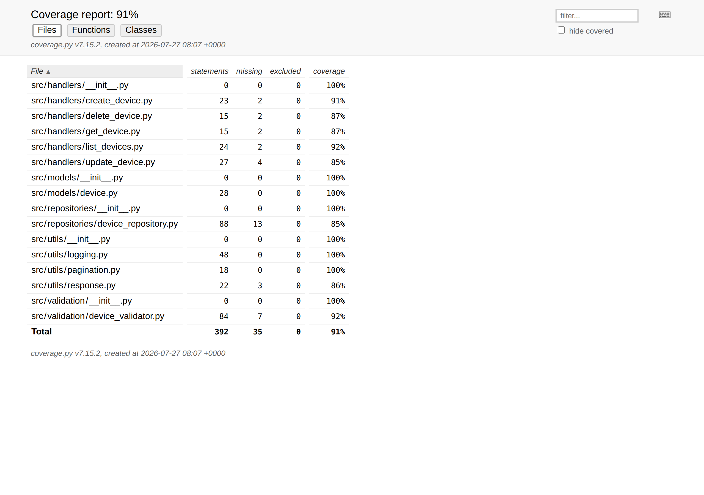
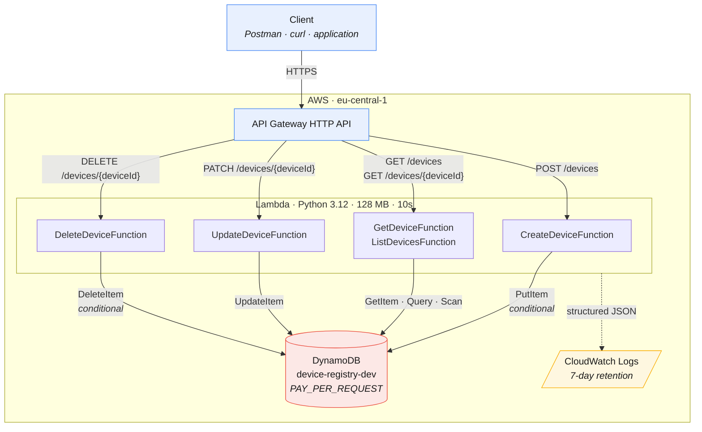
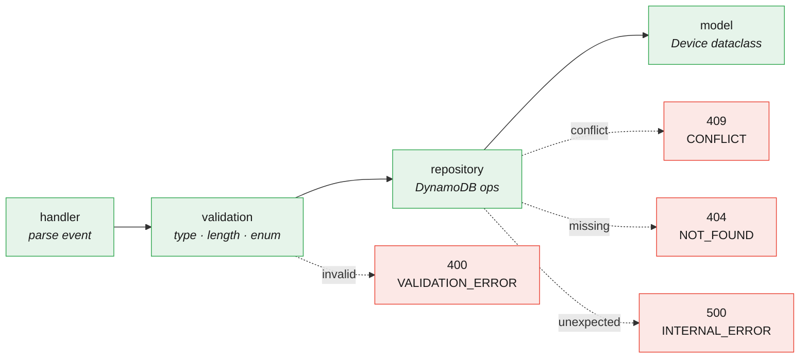
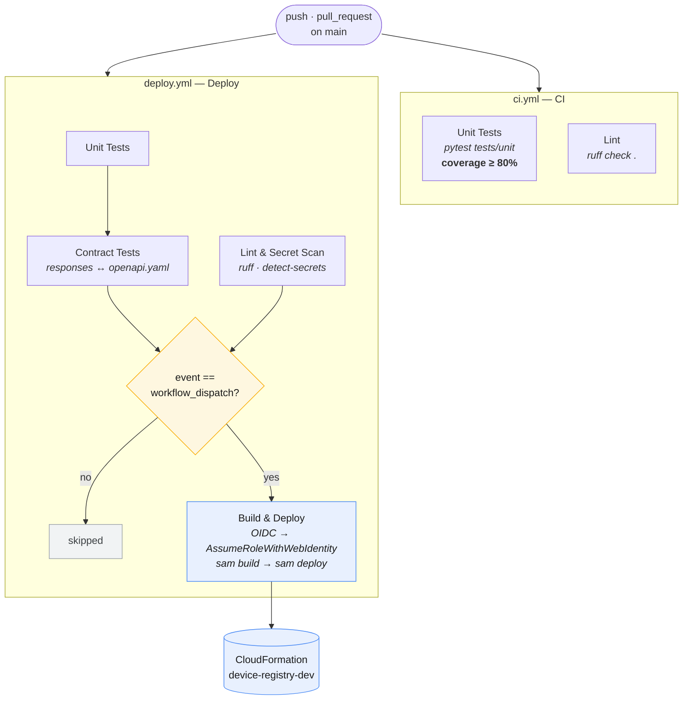

# Serverless Device Registry API

[](https://github.com/Joun-Mikhail/device-registry-serverless-api/actions/workflows/ci.yml)
[](https://github.com/Joun-Mikhail/device-registry-serverless-api/actions/workflows/ci.yml)
[](https://www.python.org/)
[](LICENSE)

**[→ Try the app](https://joun-mikhail.github.io/device-registry-serverless-api/app.html)** — a working interface, no account or install needed ·
**[→ Project site](https://joun-mikhail.github.io/device-registry-serverless-api/)** — API reference, live coverage report, plain-language overview.

> A REST API for registering and managing IoT devices, built as a portfolio project
> to practise serverless patterns end to end.
> Built with Python, AWS Lambda, API Gateway HTTP API, and DynamoDB,
> packaged with AWS SAM and exercised by a GitHub Actions pipeline.

**Status —** Portfolio project, actively maintained as a learning exercise.

- **Runs on every push:** unit tests, contract tests, `ruff` lint, and secret
  scanning via GitHub Actions. These are the checks the badges above reflect.
- **Deployment:** the SAM stack (`template.yaml`) targets a single `dev`
  environment in `eu-central-1` and is deployed **manually** via
  *Actions → Deploy → Run workflow* using GitHub OIDC. **No public endpoint is
  published in this repository**, so there is no live URL to try.
- **Authentication:** every route is guarded by a Lambda authorizer checking a
  shared API key held in AWS Secrets Manager. The key is generated at deploy time
  and never appears in this repository.
- **Out of scope:** per-caller credentials and scopes (the key is shared, not
  per-client), a multi-environment promotion pipeline, custom domains, autoscaling
  and cost tuning, and production-grade alerting. See
  [Future Improvements](#future-improvements) for the intended order of work.

---

## What this project is, in plain terms

**The problem.** Imagine a company with thousands of pieces of connected
equipment — temperature sensors in a warehouse, door controllers in an office,
network gateways on a factory floor. Someone has to keep an authoritative list of
them: what each one is, where it is, and whether it is currently working.

**What this is.** A small web service that keeps that list. Other software can ask
it to add a device, look one up, search the list, update a device's details, or
remove one. It is the address book behind the equipment.

It is not an app with buttons and screens. It is the part that sits underneath and
answers questions from other programs — the same way a hotel's booking system
answers the website, the mobile app, and the front desk without ever being seen
directly.

### What happens when something uses it



The checking step matters more than it looks. A lot of the engineering here is
about refusing bad input clearly instead of storing something broken — and about
never letting an unexpected failure leak internal details back to whoever asked.

### The vocabulary, translated

The rest of this document uses industry terms. Here is what they mean:

| Term | What it actually means |
|---|---|
| **API** | A way for one program to ask another program for something. No screens involved. |
| **Serverless** | The code runs only when someone makes a request, and there is no server sitting idle in between. You are billed per request rather than per hour. |
| **AWS Lambda** | Amazon's service for running small pieces of code on demand. Five of them here — one per action: add, fetch, search, update, remove. |
| **API Gateway** | The front door. Receives requests from the internet and routes each to the right piece of code. |
| **DynamoDB** | The database where the device list is stored. |
| **CloudWatch** | Where the service writes its diary, so problems can be traced after the fact. |
| **Infrastructure as code** | The cloud setup is written down in a file (`template.yaml`) rather than clicked together by hand — so it is reviewable, repeatable, and hard to get subtly wrong. |
| **CI / CI pipeline** | An automated checker. Every time the code changes, a robot re-runs all the tests and refuses the change if anything breaks. |
| **Unit / contract test** | Automated checks. A unit test verifies one small behaviour; a contract test verifies the service still replies in the shape it promised. |
| **Coverage** | What share of the code the automated tests actually exercise. Here: 92%. |

### What this demonstrates

| Skill shown | Where to see it |
|---|---|
| Designing a web service others can build against | [API Endpoints](#api-endpoints) — every action, with example requests and replies |
| Writing automated tests, not just code | 125 tests total, all passing, [see below](#proof-you-can-check-yourself) |
| Setting up cloud infrastructure reproducibly | `template.yaml` defines every cloud resource |
| Automating quality checks | [CI/CD Pipeline](#cicd-pipeline) — tests run automatically on every change |
| Handling failure deliberately | [Validation Rules](#validation-rules) and the error paths in the diagram above |
| Documenting honestly | The Status box above states plainly what is and is not built |

---

## Proof you can check yourself

You do not need to install anything or take these claims on trust. Everything
below is independently verifiable from the browser.

**1 — The tests pass, checked automatically by GitHub, not by me.**

The green *CI* badge at the top of this page is generated by GitHub itself every
time the code changes. Clicking it opens the
[full run history](https://github.com/Joun-Mikhail/device-registry-serverless-api/actions/workflows/ci.yml)
— a list of every check, when it ran, and whether it passed. A red badge would
mean something is broken; neither I nor anyone else can set it to green by hand.

**2 — What the automated checks actually report.**

This is the real, unedited output from running the test suite:

```
============================= 112 passed in 14.03s =============================
Required test coverage of 91% reached. Total coverage: 91.92%
```

```
============================== 13 passed in 2.83s ==============================
```

125 automated checks, all passing. The build is configured to **fail** if coverage
drops below 91%, so the number cannot quietly rot.

**3 — What is being checked.**

| Area under test | Checks | What it confirms |
|---|---|---|
| Request handling | 34 | Each action replies correctly, including when the request is malformed |
| Input validation | 30 | Bad data is rejected with a clear explanation rather than stored |
| Database operations | 19 | Records are saved, found, updated and removed correctly |
| Search and paging | 6 | Long lists are returned in pages rather than all at once |
| Data structure | 6 | Device records keep their shape when saved and read back |
| Diagnostic logging | 4 | Every request leaves a traceable record |
| API key authentication | 13 | Requests without a valid key are refused, and a misconfigured authorizer refuses rather than letting traffic through |
| Published contract | 13 | Replies still match the shape the service promised |

**4 — Use it yourself, in your browser.** The
[device manager](https://joun-mikhail.github.io/device-registry-serverless-api/app.html)
needs no account, no install and no AWS: open it and add, filter, re-status or remove
devices straight away. By default it runs a demo entirely inside the page — nothing is
sent anywhere — but it enforces the *same* validation rules the service does, so a
rejected name is rejected for the same reason it would be in production. The
*Connect to a live API* panel points the same interface at a real deployment.



Submitting an empty form shows what the service would say, before a request is sent:



**5 — The API, actually running.** You can run it yourself in two commands, with no
AWS account — an in-memory DynamoDB stands in for the real one, and every other
layer is the code that would run in Lambda:

```bash
pip install -r requirements-dev.txt
python scripts/local_server.py --seed
```

Below is a real session against that server — a successful create, a filtered and
paginated list, a rejected invalid request, and a lookup that finds nothing. The
output is reproduced exactly as the server returned it:



**6 — Authentication, refusing what it should.** Every route requires an
`x-api-key` header. The same server, started with `--api-key`, rejects a request
with no key and one with the wrong key, and serves the one that presents the
right key:



**7 — The coverage report, generated from the test run:**



It is also [published live](https://joun-mikhail.github.io/device-registry-serverless-api/coverage/),
regenerated automatically every time the code changes.

**8 — The full history is public.** Every change is a separate, reviewable entry
in the [commit history](https://github.com/Joun-Mikhail/device-registry-serverless-api/commits/main),
each explaining what changed and why.

> **On the one thing that is not demonstrated:** the service has not been deployed
> to a public *cloud* address, so there is no internet-facing endpoint to send
> requests to. The screenshots above are of it running locally. That is a deliberate choice — a permanently running cloud environment
> costs money and, without an authentication layer built yet, should not be exposed
> publicly. Everything above is verified by automated tests against a simulated
> cloud database, which is standard practice and how the vast majority of
> professional test suites run.

---

## Overview

> *Everything from here on is written for a technical audience. If you came for the
> summary, the two sections above cover it.*

The Device Registry API provides CRUD operations over a catalogue of IoT devices.
Each device has a name, type, status, and optional location and metadata. The service
is fully stateless — all state lives in DynamoDB, all compute in Lambda.

**Technical breakdown:**

| Area | Implementation |
|---|---|
| Serverless architecture | Lambda + API Gateway HTTP API + DynamoDB |
| Infrastructure as code | AWS SAM (`template.yaml`) |
| CI/CD | GitHub Actions with keyless OIDC authentication |
| Least-privilege IAM | Per-function DynamoDB policies (Read / Write / Crud) |
| Testability | `moto`-backed unit tests, zero AWS account required |
| Code quality | Layered architecture: handlers → validation → repository → model |
| Observability | Structured JSON logging with request ID correlation; log groups declared with 7-day retention |

---

## Architecture



Each request flows through four layers before reaching DynamoDB:



The ASCII rendering of these diagrams is kept in
[`docs/architecture.md`](docs/architecture.md), alongside the request lifecycle,
CI/CD pipeline diagram, DynamoDB access patterns, and IAM model.

---

## Quick Start (local tests — no AWS required)

```bash
git clone https://github.com/Joun-Mikhail/device-registry-serverless-api.git
cd device-registry-serverless-api

python -m venv .venv
source .venv/bin/activate        # Windows: .venv\Scripts\activate

pip install -r requirements-dev.txt
pytest
```

Expected output: `112 passed, coverage 92%`.

---

## API Endpoints

All requests and responses use `Content-Type: application/json`.
Responses include CORS headers (`Access-Control-Allow-Origin: *`).

### Authentication

Every route requires an `x-api-key` header. The key is generated by
CloudFormation at deploy time and stored in AWS Secrets Manager — it is not in
this repository. Retrieve it from the stack output:

```bash
aws secretsmanager get-secret-value \
  --secret-id "$(aws cloudformation describe-stacks \
      --stack-name device-registry-dev \
      --query "Stacks[0].Outputs[?OutputKey=='ApiKeySecretArn'].OutputValue" \
      --output text)" \
  --query SecretString --output text
```

Then send it with each request:

```bash
curl -H "x-api-key: <key>" https://<api-url>/dev/devices
```

A request without a valid key is rejected by the Lambda authorizer **before it
reaches any handler**, so it never touches DynamoDB:

```json
{ "message": "Unauthorized" }
```

That body comes from API Gateway, not from this service's error model — which is
why it does not carry the `error.code` envelope the endpoints below use.

To exercise this locally, start the server with a key of your choosing:

```bash
python scripts/local_server.py --seed --api-key "demo-key-abc123"
curl -H 'x-api-key: demo-key-abc123' http://127.0.0.1:8000/devices
```

### Create a device — `POST /devices`

```bash
curl -X POST https://<api-url>/dev/devices \
  -H "Content-Type: application/json" \
  -d '{"name": "Temp Sensor A", "type": "sensor", "location": "Floor 2"}'
```

**201 Created:**
```json
{
  "deviceId": "a3f1c2d4-8b5e-4f9a-bc12-d3e4f5a6b7c8",
  "name": "Temp Sensor A",
  "type": "sensor",
  "status": "active",
  "location": "Floor 2",
  "createdAt": "2024-11-01T10:30:00.123456+00:00",
  "updatedAt": "2024-11-01T10:30:00.123456+00:00"
}
```

**400 Bad Request (validation failure):**
```json
{ "error": { "code": "VALIDATION_ERROR", "message": "'type' must be one of: ['actuator', 'controller', 'gateway', 'sensor']." } }
```

**409 Conflict** is returned if a device with the same ID already exists.

---

### Get a device — `GET /devices/{deviceId}`

```bash
curl https://<api-url>/dev/devices/a3f1c2d4-8b5e-4f9a-bc12-d3e4f5a6b7c8
```

**200 OK** (device object) or **404 Not Found:**
```json
{ "error": { "code": "NOT_FOUND", "message": "Device not found." } }
```

---

### List devices — `GET /devices`

Supports cursor pagination and filtering by type.

| Query param | Default | Notes |
|---|---|---|
| `limit` | 25 | 1–100 items per page |
| `nextToken` | — | Opaque cursor from a previous response |
| `type` | — | `sensor` \| `actuator` \| `gateway` \| `controller` — served by the GSI |

```bash
# First page of 25
curl "https://<api-url>/dev/devices"

# Page of 10, filtered by type (uses the type-createdAt GSI Query)
curl "https://<api-url>/dev/devices?type=sensor&limit=10"

# Next page
curl "https://<api-url>/dev/devices?limit=10&nextToken=<token-from-previous-response>"
```

**200 OK:**
```json
{ "items": [ { ... } ], "count": 10, "nextToken": "eyJkZXZpY2VJZCI6..." }
```

`nextToken` is present only when more results exist.

> Filtering by `type` runs an efficient GSI **Query**. The unfiltered list is a
> **paginated Scan** (bounded by `limit` per request) — the one remaining
> full-table operation, documented in [Architecture](docs/architecture.md).

---

### Update a device — `PATCH /devices/{deviceId}`

`PATCH` performs a **partial update** — only the fields provided are changed.

```bash
curl -X PATCH https://<api-url>/dev/devices/a3f1c2d4-... \
  -H "Content-Type: application/json" \
  -d '{"status": "maintenance"}'
```

**200 OK** (full updated device) or **404 Not Found**.

---

### Delete a device — `DELETE /devices/{deviceId}`

```bash
curl -X DELETE https://<api-url>/dev/devices/a3f1c2d4-...
```

**200 OK:**
```json
{ "message": "Device 'a3f1c2d4-...' deleted successfully." }
```

---

## Data Model

| Field | Type | Required | Notes |
|---|---|---|---|
| `deviceId` | String (UUID v4) | Auto-generated | DynamoDB partition key |
| `name` | String | **Yes** | 1–100 characters |
| `type` | String | **Yes** | `sensor` `actuator` `gateway` `controller` |
| `status` | String | No | `active` (default) `inactive` `maintenance` |
| `location` | String | No | Max 200 characters |
| `metadata` | Object | No | Free-form JSON — omitted from DB if not provided |
| `createdAt` | ISO 8601 | Auto-set | Immutable — never changes after creation |
| `updatedAt` | ISO 8601 | Auto-set | Updated on every write |

---

## Validation Rules

- `name` — required, non-empty, max 100 characters; leading/trailing whitespace trimmed
- `type` — required, enum: `sensor` | `actuator` | `gateway` | `controller`
- `status` — optional, enum: `active` | `inactive` | `maintenance`; defaults to `active`
- `location` — optional string, max 200 characters
- `metadata` — optional JSON object (arrays and scalars are rejected)
- PATCH requests must include at least one known field; unknown fields return `400`

---

## Testing

```
tests/
├── conftest.py                      Shared fixtures (mock DynamoDB via moto)
├── unit/                           112 tests
│   ├── test_device_model.py         Dataclass serialisation (6 tests)
│   ├── test_device_validator.py     Validation — create, update, list params (30 tests)
│   ├── test_device_repository.py    DynamoDB ops, GSI query, pagination, conflict (19 tests)
│   ├── test_handlers.py             End-to-end handler logic, mocked DB (34 tests)
│   ├── test_pagination.py           Opaque cursor encode/decode (6 tests)
│   └── test_logging.py              Structured JSON log shape + decorator (4 tests)
├── contract/                        13 tests
│   ├── test_openapi_valid.py        OpenAPI 3.0 spec is valid (2 tests)
│   └── test_contract.py             Every handler response conforms to the spec (11 tests)
└── integration/
    └── test_api.py                  Live API tests — skip if API_BASE_URL unset
```

**Run unit tests:**
```bash
pytest                              # uses pytest.ini defaults (tests/unit)
pytest tests/unit/ -v               # verbose
pytest --cov=src --cov-report=html  # HTML coverage report
```

**Running contract tests locally:**

Contract tests validate `docs/openapi.yaml` and assert that every handler response
conforms to its published response schema. They run against a `moto`-mocked
DynamoDB (no AWS account, no server needed).

```bash
pip install -r requirements-dev.txt
pytest tests/contract --no-cov -v
```

`--no-cov` is used because the contract suite is scoped to schema conformance, not
line coverage (the unit suite owns the 80% coverage gate). If a response ever drifts
from the spec, the contract test fails and prints the offending field and payload.

**Run integration tests:**
```bash
export API_BASE_URL=https://<api-id>.execute-api.eu-central-1.amazonaws.com/dev
pytest tests/integration/ -v
```

**Postman collection:** [`docs/postman/device-registry.postman_collection.json`](docs/postman/device-registry.postman_collection.json)

Import into Postman, set `base_url`, run in order. Each request includes automated
test assertions (status codes + response shape).

---

## Code Quality & Pre-commit

Local hooks (lint, whitespace, secret scan) are configured in
[`.pre-commit-config.yaml`](.pre-commit-config.yaml):

```bash
pip install -r requirements-dev.txt
pre-commit install          # run hooks automatically on every commit
pre-commit run --all-files  # or run them on demand
```

Hooks: `ruff` (lint, config in [`ruff.toml`](ruff.toml)), trailing-whitespace /
end-of-file fixers, `check-yaml` (`--unsafe`, for CloudFormation tags), and
[`detect-secrets`](https://github.com/Yelp/detect-secrets) against a committed
[`.secrets.baseline`](.secrets.baseline).

**Secret scanning:** `detect-secrets` blocks new credentials from being committed.
The baseline records reviewed, non-secret matches (the `"testing"` AWS stubs in
test fixtures and the regex patterns in `scripts/verify.py`). To re-audit:

```bash
detect-secrets scan --baseline .secrets.baseline   # refresh
detect-secrets audit .secrets.baseline             # review interactively
```

CI enforces the same `ruff` lint and `detect-secrets` scan on every push and PR
(the **Lint & Secret Scan** job), run directly so it doesn't depend on each
developer's pre-commit setup.

---

## CI/CD Pipeline

Two workflows. **`ci.yml`** (named *CI*, the badge above) runs the unit tests and
the coverage gate on every push and pull request. **`deploy.yml`** adds contract
tests and secret scanning, and holds the deploy job — which is gated on
`workflow_dispatch`, so it never runs on a push.



No AWS credentials are needed for anything except the deploy job, which uses
GitHub OIDC rather than stored keys.

**First-time setup:** see [`docs/oidc-setup.md`](docs/oidc-setup.md) for the IAM
role and GitHub secret configuration.

---

## Monitoring & Logging

`template.yaml` provisions one log group per function, each with 7-day
retention. They are created when the stack is deployed:

| CloudWatch Log Group (defined in `template.yaml`) | Retention |
|---|---|
| `/aws/lambda/device-registry-create-dev` | 7 days |
| `/aws/lambda/device-registry-get-dev` | 7 days |
| `/aws/lambda/device-registry-list-dev` | 7 days |
| `/aws/lambda/device-registry-update-dev` | 7 days |
| `/aws/lambda/device-registry-delete-dev` | 7 days |

Alarms and a CloudWatch dashboard are defined in `template.yaml`, and the saved
Logs Insights queries worth keeping are in
[`docs/observability.md`](docs/observability.md) — including how to reconstruct a
single request from its `requestId`, and error rate and latency percentiles by
route.

**Structured JSON logs.** Every handler is wrapped by the `log_invocation`
decorator ([`src/utils/logging.py`](src/utils/logging.py)), which emits one JSON
line per request so that, once deployed, CloudWatch Logs Insights can query by
field. Illustrative example of the shape the decorator produces (not a capture
from a deployed environment):

```json
{
  "timestamp": "2024-11-01T10:30:00.123456+00:00",
  "level": "INFO",
  "logger": "handlers.create_device",
  "message": "request",
  "operation": "CreateDevice",
  "requestId": "8f3a...",
  "method": "POST",
  "path": "/devices",
  "status": 201,
  "latencyMs": 12.4,
  "userAgent": "PostmanRuntime/7.x"
}
```

`requestId` is emitted to support cross-log correlation. Log verbosity is controlled by the
`LOG_LEVEL` environment variable in `template.yaml` — set to `DEBUG` without a
code change. Unhandled exceptions are logged at `ERROR` with `status: 500` and a
serialized traceback (never returned to the caller).

---

## Security

| Control | Implementation |
|---|---|
| No stored AWS keys | GitHub OIDC federation (`AssumeRoleWithWebIdentity`) |
| Least-privilege IAM | Per-function DynamoDB policy (Write / Read / Crud only) |
| Input validation | Type, length, and enum checks before any DB operation |
| Error isolation | Stack traces sent to the logger, never returned to callers |
| Secrets in code | None — `DEVICES_TABLE` injected by SAM at deploy time |
| Log retention | Log groups declared with 7-day retention to bound the data exposure window |
| CORS | `Access-Control-Allow-Origin: *` — permissive by design for `dev`; restrict before any public exposure |
| API authentication | Lambda authorizer on every route, validating `x-api-key` against a Secrets Manager secret. Applied as `DefaultAuthorizer`, so a newly added route is guarded unless it opts out. |
| API key storage | Generated by CloudFormation at deploy time. Only the secret's ARN reaches the authorizer's environment; the value is never in the template, the repository, or an environment variable. |
| Key comparison | Constant-time (`hmac.compare_digest`), so response timing does not leak how much of a guessed key was correct. |
| Authorizer failure mode | Fails closed. A missing secret, an AWS error, or a malformed event denies rather than raising or allowing. |
| Secret redaction | The AWS SDK's wire loggers are pinned to INFO, because botocore logs the `GetSecretValue` response body — including the key — at DEBUG, and `LOG_LEVEL` is operator-controlled. |
| **Per-caller identity** | **Not implemented — the key is shared across all clients, so requests cannot be attributed to a caller and revoking one caller revokes all.** Acceptable for a single-consumer `dev` environment; see Future Improvements. |

---

## Deployment

### Prerequisites

- [AWS SAM CLI](https://docs.aws.amazon.com/serverless-application-model/latest/developerguide/install-sam-cli.html) ≥ 1.100
- Python 3.12
- AWS credentials (for manual deploy), or an OIDC role set up per
  [`docs/oidc-setup.md`](docs/oidc-setup.md) and its ARN stored as the
  `AWS_DEPLOY_ROLE_ARN` secret (for CI)

### First deployment

```bash
sam build --parallel
sam deploy --guided
# Stack name:          device-registry-dev
# AWS Region:          eu-central-1
# Parameter overrides: Environment=dev
# Confirm changes:     Y
# Allow SAM to create roles: Y
```

### Subsequent deployments

```bash
sam build --parallel --cached && sam deploy
```

Or trigger GitHub Actions via the **Actions** tab.

---

## Cleanup

```bash
sam delete --stack-name device-registry-dev --region eu-central-1
```

> The DynamoDB table has `DeletionPolicy: Retain` — it survives stack deletion.
> Delete it manually in the console if you no longer need the data.

---

## Repository Structure

```
.
├── .github/
│   ├── dependabot.yml              Weekly pip dependency updates
│   ├── CODEOWNERS                  Review ownership
│   ├── pull_request_template.md    PR checklist
│   ├── ISSUE_TEMPLATE/             Bug report and feature request forms
│   └── workflows/
│       ├── ci.yml                  CI pipeline (unit tests + coverage gate + lint)
│       └── deploy.yml              CD pipeline (contract tests + manual SAM deploy)
├── docs/
│   ├── architecture.md             Detailed diagrams and design decisions
│   ├── oidc-setup.md               One-time AWS IAM + OIDC configuration
│   ├── openapi.yaml                OpenAPI 3.0 contract
│   ├── evidence/                   Capture instructions for deploy screenshots
│   └── postman/                    Importable Postman collection
├── scripts/
│   ├── verify.py                   Structural health checks (template, workflow, imports)
│   └── deployment_check.py         Pre-deploy readiness verification
├── src/
│   ├── handlers/                   One Lambda handler per endpoint
│   ├── models/                     Device dataclass + DynamoDB serialisation
│   ├── repositories/               DynamoDB operations (create/get/list/update/delete)
│   ├── validation/                 Input validation (create, update, list params)
│   └── utils/                      JSON logging, HTTP responses, pagination cursor
├── tests/
│   ├── unit/                      112 tests, moto-mocked DynamoDB
│   ├── contract/                   13 tests, response ↔ OpenAPI conformance
│   └── integration/                10 tests, skipped unless API_BASE_URL is set
├── template.yaml                   AWS SAM infrastructure definition
├── samconfig.toml                  SAM CLI defaults (region, stack name)
├── pytest.ini                      Test runner configuration
├── ruff.toml                       Lint configuration
├── vercel.json                     Disables Vercel git deployments (not a Vercel app)
├── .pre-commit-config.yaml         Local lint / whitespace / secret-scan hooks
├── .secrets.baseline               Reviewed detect-secrets baseline
├── .gitignore                      Build, cache, venv, and credential exclusions
├── CONTRIBUTING.md                 Setup, the checks CI runs, layering rules
├── CHANGELOG.md                    Keep a Changelog format
├── LICENSE                         MIT
└── requirements*.txt               Runtime and dev dependencies
```

---

## Future Improvements

**Done:** ✅ cursor pagination (`limit` + `nextToken`) · ✅ GSI Query for `?type=`
filtering · ✅ OpenAPI 3.0 contract + contract tests in CI · ✅ structured error model
· ✅ structured JSON request logging · ✅ ruff + detect-secrets pre-commit & CI.

In priority order:

1. **Per-caller credentials** — the API key is shared across all clients, so calls
   cannot be attributed and revocation is all-or-nothing. Issue a key per consumer,
   or move to a JWT authorizer backed by an identity provider. The previous item
   here — adding any authentication at all — is now done. Add an IAM authorizer
   (`AuthorizationType: AWS_IAM`) for service-to-service callers, or a Lambda authorizer
   validating an API key / JWT for external clients. Required before any public exposure.
2. **Eliminate the unfiltered Scan** — materialised index for the no-filter list.
3. **Dead-letter queues** — if the API grows to include async/event-driven patterns.
4. **CloudWatch metrics & alarms** — error-rate / p95-latency alarms (needs a live stack).

---

## Design trade-offs

The choices worth defending are written down as short ADRs in
[`docs/decisions/`](docs/decisions/) — context, decision, and the consequences
including the ones that are inconvenient.

| # | Decision | The trade |
|---|---|---|
| [0001](docs/decisions/0001-one-lambda-per-endpoint.md) | One Lambda per endpoint | Per-route IAM and failure isolation, paid for in cold starts and duplicated artifacts |
| [0002](docs/decisions/0002-sam-over-cdk-and-terraform.md) | SAM over CDK/Terraform | A template that reads top to bottom, at the cost of five near-identical function blocks |
| [0003](docs/decisions/0003-oidc-over-stored-keys.md) | GitHub OIDC over stored keys | No long-lived credential exists, at the cost of one-time IAM setup |
| [0004](docs/decisions/0004-layered-architecture.md) | Layered architecture | Pure, fast-to-test validation, at the cost of indirection |
| [0005](docs/decisions/0005-gsi-key-design.md) | One GSI on `type` + `createdAt` | Filtered reads become Queries; combined filters still need a filter expression |
| [0006](docs/decisions/0006-opaque-pagination-token.md) | Opaque base64 `nextToken` | Clients cannot depend on key internals; the token is encoded, not signed |
| [0007](docs/decisions/0007-api-key-over-cognito.md) | API key, not Cognito | Correct for machine-to-machine; gives up per-caller identity |
| [0008](docs/decisions/0008-per-function-iam.md) | Per-function IAM | Read paths cannot write; update and delete are still broader than ideal |

---

## Contributing

Setup, the exact checks CI enforces, and the layering conventions are in
[`CONTRIBUTING.md`](CONTRIBUTING.md). Notable changes are tracked in
[`CHANGELOG.md`](CHANGELOG.md).

---

## License

Released under the [MIT License](LICENSE).
